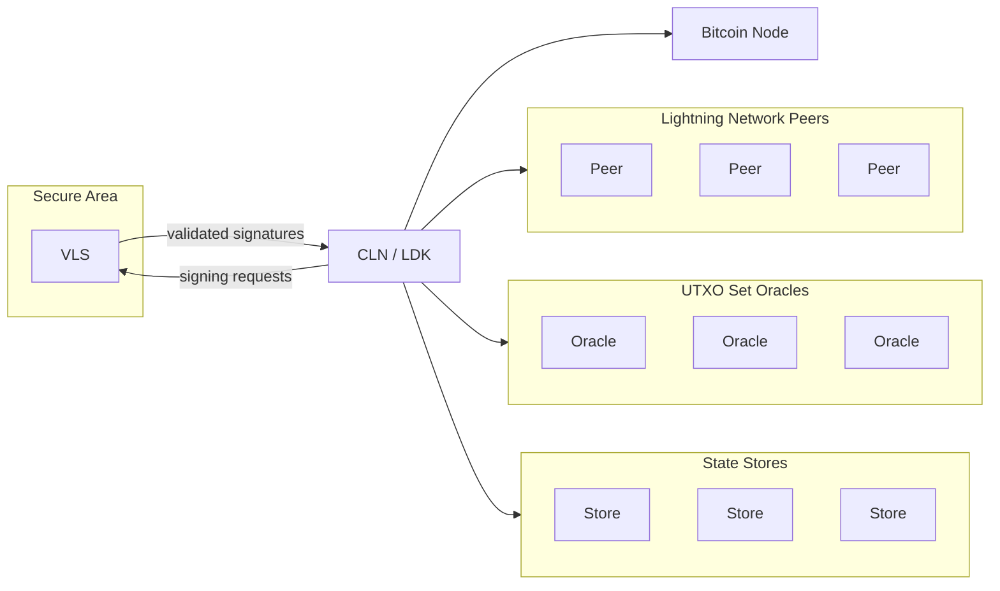

## Intro
Validating Lightning Signer (VLS) is an open-source **Rust library for secure, self-custodial Lightning signers**. Unlike hot wallets or blind signers, VLS keeps your private keys off the node **and** validates each signing request, ensuring only legitimate channel operations are approved. In other words, even if your Lightning node were compromised, funds remain safe thanks to the signer’s rigorous policy checks.

---

> 🧠 **New to VLS?** Learn why validation matters:  
> 👉 [Why Validating Signing?](./why-validating-signing.md)

> ⚡ **Ready to integrate?**  
> 👉 [Start Here → Choose your stack](../Get-Started/start-here.md)

---

## System Overview
---
VLS splits Lightning key management into two primary components:

1. **Lightning Node**  
   Runs the usual LN logic: channel opening, routing, HTLC management, etc. But **no** private keys for signing are stored here.

2. **Remote Validating Signer**  
   Stores private keys in a secure environment and **validates** each request (e.g., channel updates, HTLC commitments) before generating a signature. If the request fails policy checks, it denies signing.

**Additional Components**  
- **Policy Engine**: A customizable set of rules ensuring no suspicious or off-protocol requests are signed.  
- **UTXO Oracle (Optional)**: The signer can be configured to receive chain data to detect remote breaches or track on-chain states (e.g., unconfirmed inputs, HTLC expiries).  
- **State Storage**: Provides secure, redundant cloud storage for Lightning nodes and signers with anti-rollback protection.

## Architecture Overview
---
Below is a simplified technical breakdown of how VLS integrates with Lightning nodes:

1. **Integration Points**  
   - **c-lightning/CLN**: Use the `vls-hsmd` plugin so the node’s signing calls are forwarded to VLS.  
   - **LDK**: Use the `lnrod` example or similar to route signing requests to the VLS library.

2. **Validation Flow**  
   1. **Node** proposes a transaction or state update.  
   2. **VLS** checks protocol correctness and local policy (e.g., channel open, HTLC amounts, no double revoke).  
   3. **If valid**, the signer returns a signature. Otherwise, it rejects the request.

3. **Hardware vs. Software Deployment**  
   - VLS can run in a dedicated hardware security module (HSM), a secure enclave, or simply as a separate process/container.  
   - For extremely large LN balances, hardware isolation is recommended.

4. **Performance & Scalability**  
   - Rust ensures efficient, safe concurrency.  
   - The overhead for real-time transaction signing is minimal compared to typical LN operations.  

## Getting Started
---
### Option 1: CLN + VLS
- [CLN & VLS Setup Guide](../Get-Started/cln-vls.md)  
- Basic steps:
  1. Perform one-time dependencies install.  
  2. Build and install `vls-hsmd`.  
  3. Configure `lightningd` to use the remote signer plugin.  
  4. Start your LN node + VLS signer processes.

### Option 2: LDK + VLS
- [LDK & VLS Guide](../Get-Started/ldk-vls.md)  
- Basic steps:
  1. Clone the `lnrod` repository (a reference LDK node).  
  2. Integrate the `vls-proxy` crate for signing.  
  3. Test basic LN operations to confirm validation.

### Option 3: Dockerized VLS
- [Docker Setup Guide](../Get-Started/docker.md)  
- Use pre-built Docker images for a single test environment or multi-service deployment including `bitcoind`, `CLN`, `txood` (UTXO oracle), and VLS signer.

## Next Steps / Further Resources
---
1. **Policy & Security Deep Dive**  
   - [Security Policies & Pitfalls](../Security/policy-controls.md)  
   - Understand the specific policy rules that protect channel funds from typical LN exploits.

2. **Sequence Diagrams & Protocol**  
   - [Sequence Diagrams](../seq-diagrams/) show how VLS signs off at each step of the LN life cycle.

3. **Contributing / Reporting Issues**  
   - We welcome contributors! Check out our [GitLab project](https://gitlab.com/lightning-signer/validating-lightning-signer/) or open an issue.  
   - Need help? Drop in on our [Matrix channel](https://matrix.to/#/#vls-general:matrix.org).
