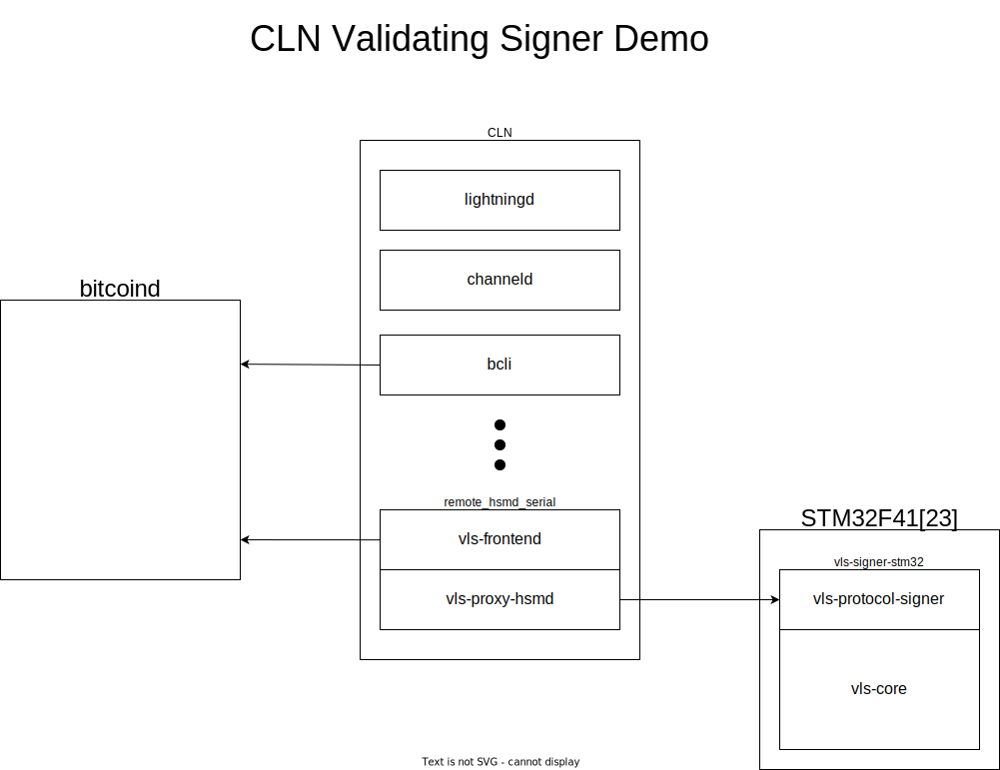
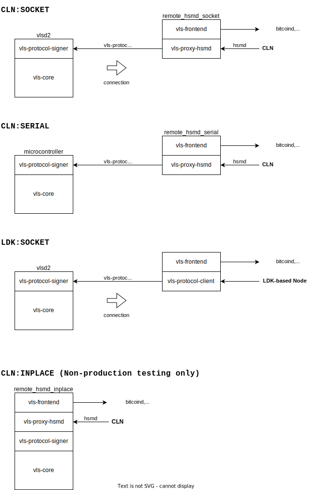
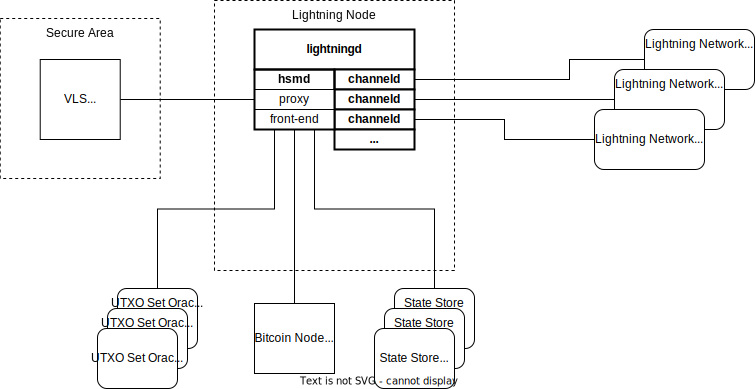
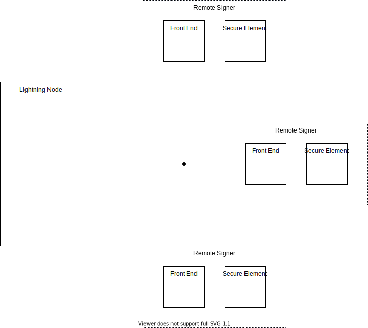

## c-Lightning Validating Signer Demo

 

    

 

 

## VLS Integration Modes

VLS components can be integrated with [C-Lightning (`CLN`)](https://gitlab.com/lightning-signer/vls-hsmd) or the [Lightning Development Kit (`LDK`)](https://gitlab.com/lightning-signer/lnrod).

NOTE - All combinations are not depicted, for example `LDK:SERIAL` is a valid mode.

 

    

 

 

## System Overview

The Lightning Node makes requests to the Remote Signer to generate
signatures for lightning operations.

 

    

 

Detail:

* The Remote Signer consists of two processing entities.

    - The Front End has reasonable resources and is connected to the
      network.
      
    - The Secure Element has limited resources and is hardened against
      physical attacks.
      
* Validation of a request signing operation may require proof that
  UTXOs are currently unspent.  Requests are made to a (set) of UTXO
  set Oracles which provide proofs of inclusion.
  
* A design requirement is that an exploit which compromises the Front
  End but not the Secure Element cannot violate signing policies.

 

## Multi-Party Signing

Additional protection may be obtained by using multi-party
computation to generate the signatures.

 

    

 

The Lightning Node makes requests to any one of the Remote Signers.
The Remote Signer Front End initiates the multi-party signing
operation and relays the resulting signature(s) back to the
Lightning Node.

## Protocol-Level Signing Flow

Want to see how VLS fits into the Lightning lifecycle?

Check out our [Sequence Diagrams](../seq-diagrams/) for:

- [Channel Establishment](../seq-diagrams/channel-establishment.md)
- [Normal Operation](../seq-diagrams/normal-operation.md)
- [Lightning Transaction Signing Details](../seq-diagrams/transaction-diagrams.md)
