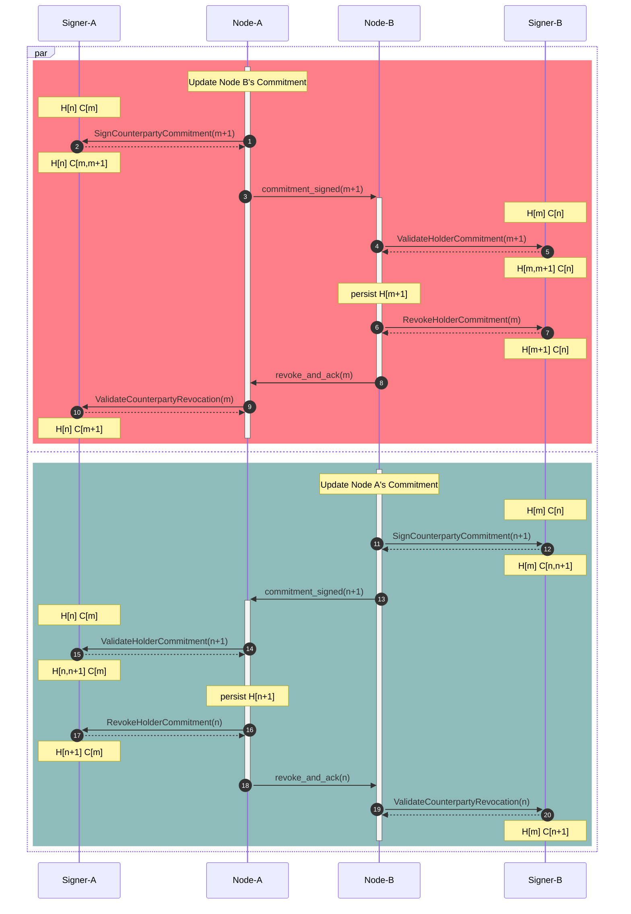

[BOLT #2 - Normal Operation](https://github.com/lightningnetwork/lightning-rfc/blob/master/02-peer-protocol.md#normal-operation)

 

   | State Notation  | Signer State                                                     |
   |-----------------|------------------------------------------------------------------|
   | `H[] C[]`       | no holder commitment, no counterparty commitment                 |
   | `H[0] C[0]`     | holder initial commitment, counterparty initial commitment       |
   | `H[n] C[m]`     | holder commitment n, counterparty commitment m                   |
   | `H[n,n+1] C[m]` | holder commitment n and n+1, counterparty commitment m           |
   | `H[n]*`         | holder base commitment, splice, and RBF candidates for n         |
   | `H[n,n+1]*`     | holder base commitment, splice, and RBF candidates for n and n+1 |

 

 
