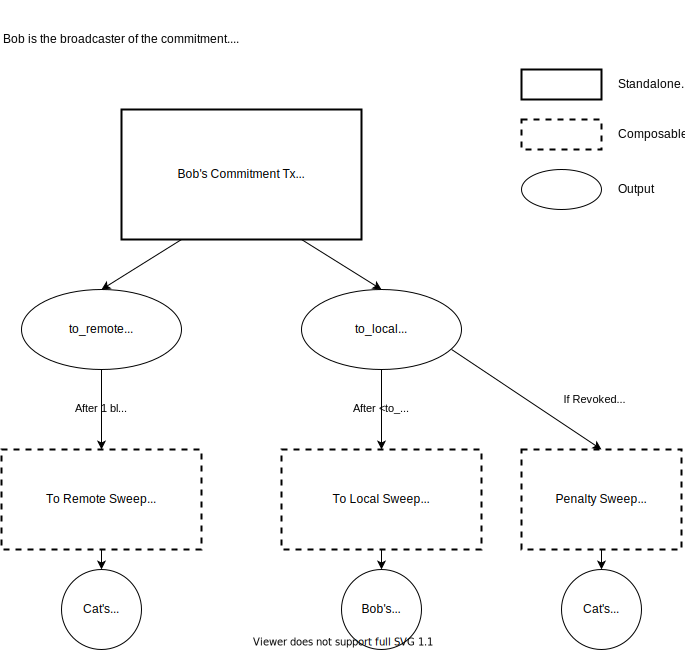
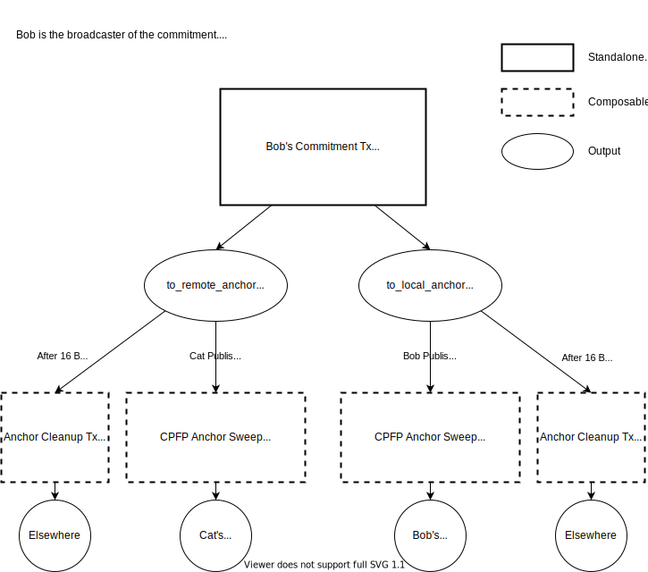
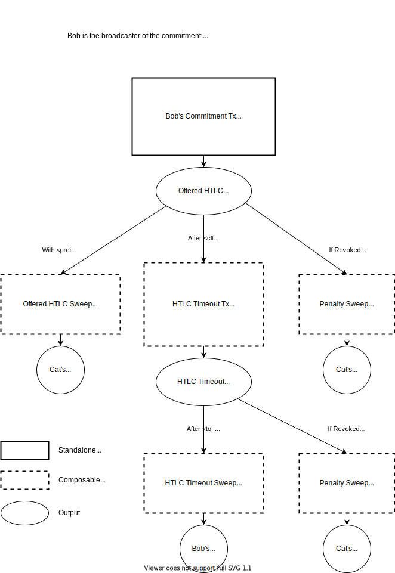
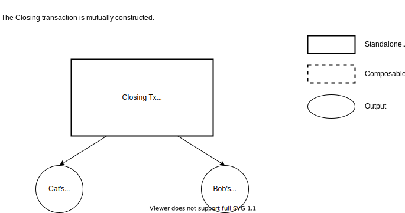

## Lightning Transaction Signing Details

The Lightning Node makes requests to the Remote Signer to generate
signatures for lightning operations.  These outputs and transactions
are discussed in depth in [BOLT #3](https://github.com/lightningnetwork/lightning-rfc/blob/master/03-transactions.md).

 

These diagrams show the remote signing API calls used to generate
signatures for each transaction in the lightning flow.

 

Diagrams maintained using [app.diagrams.net](https://app.diagrams.net/)

 

 

## `to_local` and `to_remote` Output Signing

[BOLT #3 - to_local and to_remote Outputs](https://github.com/lightningnetwork/lightning-rfc/blob/master/03-transactions.md#to_local-output)

 

    

 

## `to_local_anchor` and `to_remote_anchor` Output Signing

[BOLT #3 - to_local_anchor and to_remote_anchor Outputs](https://github.com/lightningnetwork/lightning-rfc/blob/master/03-transactions.md#to_local_anchor-and-to_remote_anchor-output-option_anchor_outputs)

 

    

 

## Offered HTLC Output Signing

[BOLT #3 - Offered HTLC Outputs](https://github.com/lightningnetwork/lightning-rfc/blob/master/03-transactions.md#offered-htlc-outputs)

 

    

 

## Received HTLC Output Signing

[BOLT #3 - Received HTLC Outputs](https://github.com/lightningnetwork/lightning-rfc/blob/master/03-transactions.md#received-htlc-outputs)

 

    

 

## Closing Transaction Signing

[BOLT #3 - Closing Transaction](https://github.com/lightningnetwork/lightning-rfc/blob/master/03-transactions.md#closing-transaction)
 

    

 
